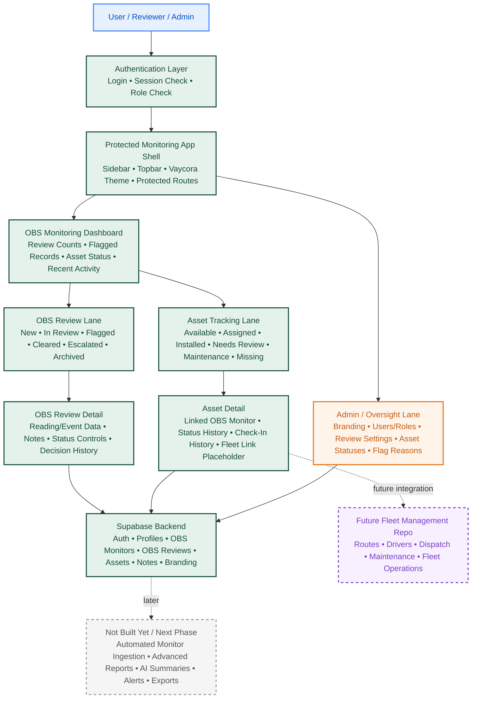

# Vaycora Monitoring Platform — Architecture + Work Lanes

**Purpose:** Internal platform for OBS monitor review data, basic OBS asset tracking, authentication, admin controls, and Vaycora branding.

**Hard boundary:** This repo does **not** include fleet management, routing, dispatch, bookings, owner intake, listing approval, or the public Vaycora Outdoors app.

---

## Legend

| Color / Style | Meaning |
|---|---|
| Green | Build now / harden first |
| Blue | UI surface / placeholder exists |
| Orange | Admin / configurable controls |
| Purple dotted | Future integration only |
| Gray dashed | Not built yet / next phase |

---

# Page 1 — Physical Architecture Structure

## Architecture Map



## Physical Repo Structure

```txt
vaycora-monitoring-platform
├── Authentication
│   └── Login page
│
├── App Shell
│   ├── Sidebar
│   ├── Topbar
│   ├── Brand logo placeholder
│   └── Theme variables
│
├── OBS Monitoring
│   ├── Dashboard
│   ├── OBS review table
│   ├── OBS review detail
│   ├── Status controls
│   └── Review notes
│
├── Asset Tracking
│   ├── Live asset table
│   ├── Asset detail page
│   ├── Status controls
│   ├── Check-in history
│   └── Fleet management link placeholder
│
├── Admin
│   ├── Branding
│   ├── Users
│   ├── Roles
│   ├── Review settings
│   ├── Asset settings
│   └── System settings
│
└── Supabase Backend
    ├── Auth
    ├── Database
    ├── Realtime
    └── Storage later
```

## Build Now

- [ ] Login/auth page
- [ ] Protected app shell
- [ ] OBS dashboard
- [ ] OBS review table
- [ ] OBS review detail page
- [ ] Asset tracking table
- [ ] Asset detail page
- [ ] Admin page
- [ ] Branding settings page
- [ ] Supabase schema

## Not Built In This Repo

- [ ] Fleet routes
- [ ] Driver dispatch
- [ ] Maintenance scheduling
- [ ] Trip operations
- [ ] Public listings
- [ ] Bookings
- [ ] Owner intake
- [ ] Payment flows

---

# Page 2 — Work Lanes + Work Trees

## Work Lane Map

```mermaid
flowchart LR
    auth[1. Authentication Lane<br/>Login • Roles • Protected Routes]:::green
    ui[2. UI Shell + Branding Lane<br/>Theme • Sidebar • Tables • Cards]:::orange
    data[3. Supabase Data Lane<br/>Schema • Seed Data • RLS Policies]:::green
    obs[4. OBS Review Workflow Lane<br/>Queue • Detail • Notes • Status Decisions]:::green
    assets[5. Asset Tracking Lane<br/>Live Table • Detail • History • Fleet Link]:::green
    admin[6. Admin Backend Lane<br/>Branding • Users • Settings • Flag Reasons]:::orange
    harden[7. Hardening Lane<br/>Validation • Audit Trail • Error States • No Hard Deletes]:::green
    future[8. Future Integration Lane<br/>Fleet Repo Link • API Later]:::purple

    auth --> ui --> data --> obs --> assets --> admin --> harden --> future

    classDef green fill:#E5F2EB,stroke:#154D37,color:#154D37,stroke-width:2px;
    classDef orange fill:#FFF4EA,stroke:#E96F12,color:#C45A0C,stroke-width:2px;
    classDef purple fill:#F8F0FF,stroke:#793EC7,color:#793EC7,stroke-width:2px,stroke-dasharray: 5 5;
```



---

## Lane 1 — Authentication Lane

### Build
- [ ] Create `/login`
- [ ] Connect Supabase Auth
- [ ] Add protected route wrapper
- [ ] Add logout
- [ ] Create `profiles` table
- [ ] Add roles: `admin`, `reviewer`, `viewer`

### Harden
- [ ] Block unauthenticated users
- [ ] Block non-admin users from admin routes
- [ ] Add session loading state
- [ ] Add invalid login error state

### Done When
- [ ] Only authenticated users can enter the app
- [ ] Roles control what pages/actions each user can access

---

## Lane 2 — UI Shell + Branding Lane

### Build
- [ ] Add Vaycora theme variables
- [ ] Add placeholder logo: `Vaycora Monitoring`
- [ ] Build sidebar navigation
- [ ] Build topbar
- [ ] Build reusable cards
- [ ] Build reusable data table
- [ ] Build status badges

### Brand Defaults

```txt
Primary Green: #154D37
Accent Orange: #E96F12
Warm Background: #F4EFE6
Dark Text: #102A24
Muted Text: #5B6B63
```

### Harden
- [ ] Use variables instead of hard-coded colors
- [ ] Keep orange as accent, not everywhere
- [ ] Check color contrast
- [ ] Add responsive layout behavior

### Done When
- [ ] Dashboard, reviews, assets, and admin pages feel like one polished Vaycora product

---

## Lane 3 — Supabase Data Lane

### Build
- [ ] Create `profiles`
- [ ] Create `obs_monitors`
- [ ] Create `obs_reviews`
- [ ] Create `assets`
- [ ] Create `review_notes`
- [ ] Create `asset_events`
- [ ] Create `branding_settings`
- [ ] Add seed data

### Harden
- [ ] Enable Row Level Security
- [ ] Add role-based policies
- [ ] Add `created_at` and `updated_at`
- [ ] Add indexes for search/filter fields
- [ ] Track `created_by`, `reviewer_id`, and `updated_by`

### Done When
- [ ] App tables and status counts are powered by Supabase, not static placeholders

---

## Lane 4 — OBS Review Workflow Lane

### Build
- [ ] Create `/obs-reviews`
- [ ] Create `/obs-reviews/[reviewId]`
- [ ] Show review queue table
- [ ] Add search/filter/sort
- [ ] Add review detail view
- [ ] Add notes
- [ ] Add status controls

### Statuses

```txt
New
In Review
Flagged
Cleared
Escalated
Archived
```

### Harden
- [ ] Validate status transitions
- [ ] Track who changed status
- [ ] Track when status changed
- [ ] Preserve decision history
- [ ] Prevent accidental deletes
- [ ] Add empty/loading/error states

### Done When
- [ ] A reviewer can open a record, add notes, and mark it cleared, flagged, escalated, or archived

---

## Lane 5 — Asset Tracking Lane

### Build
- [ ] Create `/assets`
- [ ] Create `/assets/[assetId]`
- [ ] Show live asset table
- [ ] Add asset detail view
- [ ] Add edit asset form
- [ ] Add asset event history
- [ ] Link each asset to OBS monitor when available
- [ ] Add `linked_fleet_asset_id` placeholder

### Asset Statuses

```txt
Available
Assigned
Installed
Needs Review
Maintenance
Retired
Missing
```

### Table Fields

```txt
Asset ID
Asset Type
OBS Monitor ID
Serial Number
Status
Assigned Location
Install Date
Last Check-In
Last Maintenance Check
Condition
Linked Fleet Asset ID
Notes
```

### Harden
- [ ] Prevent duplicate asset tags
- [ ] Validate asset statuses
- [ ] Track status changes
- [ ] Track asset events
- [ ] Make missing/offline assets obvious
- [ ] Keep fleet management limited to reference links only

### Done When
- [ ] The platform shows what OBS assets exist, where they are, what status they are in, and what monitor/review records they connect to

---

## Lane 6 — Admin Backend Lane

### Build
- [ ] Create `/admin`
- [ ] Create `/admin/branding`
- [ ] Create `/admin/users`
- [ ] Create `/admin/settings`
- [ ] Add role management placeholder
- [ ] Add flag reason settings
- [ ] Add asset status settings

### Admin Controls

```txt
Brand name
Logo placeholder
Primary color
Accent color
Background color
Users
Roles
Flag reasons
Review statuses
Asset statuses
```

### Harden
- [ ] Restrict admin pages to Admin role
- [ ] Validate color values
- [ ] Prevent removal of required statuses
- [ ] Add audit trail for important changes

### Done When
- [ ] Admin can manage branding, users, roles, review settings, and asset settings

---

## Lane 7 — Hardening Lane

### Harden Every Lane With
- [ ] Authentication checks
- [ ] Role checks
- [ ] Input validation
- [ ] Status validation
- [ ] Loading states
- [ ] Error states
- [ ] Empty states
- [ ] Audit trail
- [ ] No hard deletes
- [ ] Consistent UI

### Done When
- [ ] The app can be used daily without feeling fragile

---

## Lane 8 — Future Integration Lane

### Build Now
- [ ] Add `linked_fleet_asset_id`
- [ ] Add `fleet_system_url`
- [ ] Add `fleet_sync_status`
- [ ] Add `last_synced_at`
- [ ] Add disabled `Open in Fleet Management` button

### Not Built Yet
- [ ] Fleet routes
- [ ] Dispatch
- [ ] Drivers
- [ ] Maintenance scheduling
- [ ] Trip operations
- [ ] Booking operations

### Done When
- [ ] Monitoring can connect to fleet management later without this repo becoming fleet management

---

# Sprint Plan

## Sprint 1 — App Foundation
- [ ] Login page
- [ ] Protected dashboard
- [ ] Vaycora theme
- [ ] Sidebar/topbar
- [ ] Static OBS dashboard
- [ ] Static asset table

## Sprint 2 — Real Data
- [ ] Supabase schema
- [ ] Auth connected
- [ ] OBS reviews connected
- [ ] Assets connected
- [ ] Seed data added

## Sprint 3 — Workflow
- [ ] Review detail page
- [ ] Review status controls
- [ ] Review notes
- [ ] Asset detail page
- [ ] Asset event history

## Sprint 4 — Admin + Hardening
- [ ] Admin page
- [ ] Branding page
- [ ] Users/roles
- [ ] RLS policies
- [ ] Audit trail
- [ ] Error/loading/empty states

---

# Clean Final Scope

## Built For
- OBS review data workflow
- Physical OBS asset tracking
- Admin/backend controls
- Branding/theme management
- Future fleet integration reference

## Not Built For
- Fleet management
- Dispatch
- Routes
- Bookings
- Owner intake
- Listing approval
- Public marketplace
